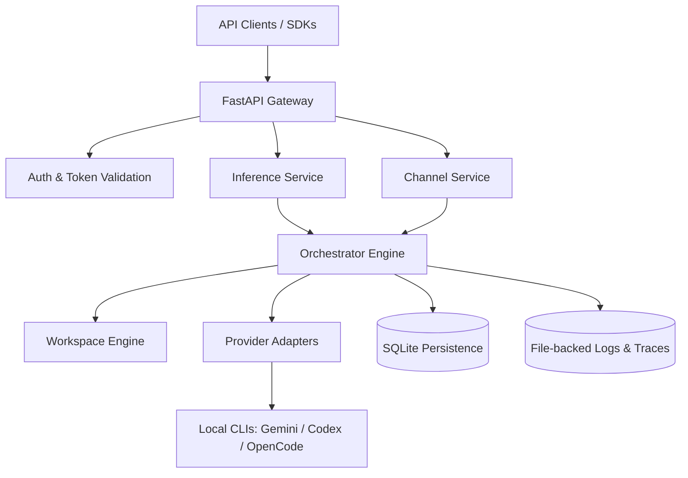
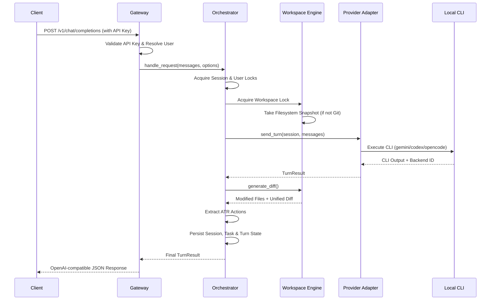

# System Architecture

Codara is built as a modular gateway that coordinates between external API clients, internal orchestration logic, and local CLI-native provider runtimes.

## Component Overview

## Request Flow

The following diagram illustrates the lifecycle of a standard inference request:

## Internal Layer Responsibilities

### 1. Gateway Layer
- **FastAPI Application**: Serves as the web entry point.
- **Request Shaping**: Normalizes OpenAI-style requests into internal `UagOptions`.
- **Security**: Handles JWT-based dashboard auth and API-key-based user auth.

### 2. Orchestration Layer
- **Concurrency Control**: Uses semaphores and per-session/per-user locks to prevent race conditions.
- **Task Management**: Creates and tracks the lifecycle of every request as a `Task`.
- **State Persistence**: Interfaces with SQLite to store long-lived metadata.

### 3. Execution Layer
- **Provider Adapters**: Specialized wrappers for different LLM runtimes (Gemini, Codex, OpenCode). They communicate with local CLIs via subprocesses.
- **Workspace Engine**: Manages the directory where agents work. It handles locking, Git integration, and filesystem diffing.

### 4. Persistence Layer
- **SQLite**: Primary store for users, workspaces, sessions, tasks, and audit logs.
- **Log Shards**: Transactional execution logs and traces stored as individual files for high-volume observability.
